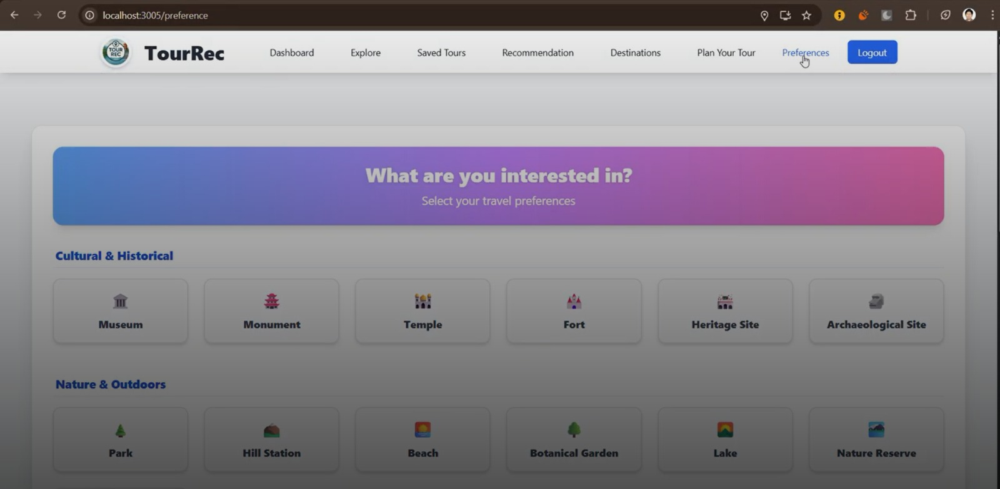
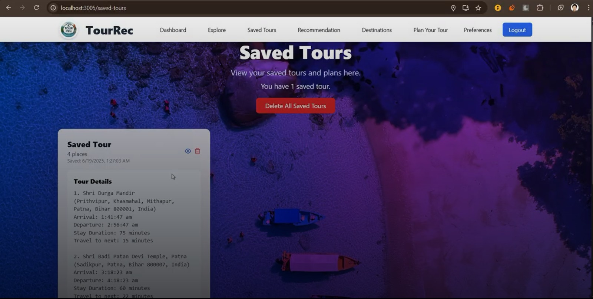
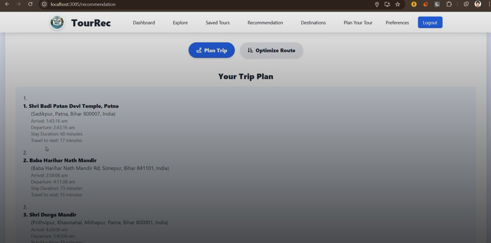
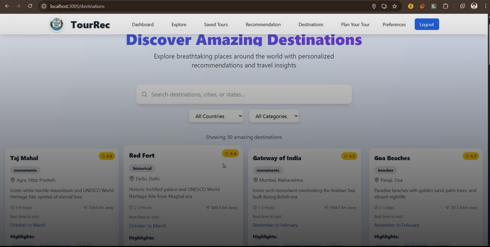

# Tour Recommendation System
**A Personalized Web-Based Tour Planning Platform**

---

## PROJECT REPORT

### Group 22

| Name                | Enrollment Number | Mobile Number |
|---------------------|------------------|--------------|
| Shiv Shakti Kumar   | 23114091         | 8290957549   |
| Lakhveer Singh      | 23114054         | 8290002430   |

**Contribution:**
- Shiv Shakti Kumar: Frontend development, UI/UX design, Google Maps API integration, and user authentication.
- Lakhveer Singh: Backend development, database modeling, REST API design, and integration with Google Places API.

---

## Table of Contents
1. Introduction and Background  
   1.1 Problem Statement  
   1.2 Project Details  
2. Application of the Project  
   2.1 Real-world Use Cases  
   2.2 Target Audience  
3. Unique Selling Proposition (USP)  
   3.1 Key Differentiators  
   3.2 Comparative Advantage  
4. Tools and Technologies  
   4.1 Programming Languages  
   4.2 Frameworks and Libraries  
   4.3 Development and Deployment Tools  
5. Methodology  
   5.1 System Architecture  
   5.2 Data Collection and Preprocessing  
   5.3 Route Optimization Design  
   5.4 Workflow  
6. Results  
   6.1 Performance Metrics  
   6.2 Evaluation and Analysis  
7. Screenshots  
   7.1 User Interface  
   7.2 System Workflow  
8. Conclusion  
9. Future Work  
10. References  

---

## 1. Introduction and Background

### 1.1 Problem Statement
Planning travel is complicated and time-consuming, especially for those visiting unfamiliar cities or countries. Tourists face difficulties choosing the best places to see, path their routes efficiently, and keep track of itinerary planning. There is so much information available on the online platform that one seldom figures out the must-see spots and those that bring very less value. Wild manual planning often incurs missed opportunities, circuitous routes, and quality with negative experience. 

Even more so, today's traveler expects digital solutions that recommend themselves and allow easy planning. Without a unified interface, users must piece things together in multiple phases, dragging them through grueling efforts leading to far-from-optimal results.

### 1.2 Project Details
A Tour Recommendation System is a web-based platform conceived for handling these problems and providing a complete, easy-to-use solution to tourists for discovering destinations, getting recommended destinations, and planning their optimized tours. The system, using Google Maps and Places APIs, gives real-time data and information, and route optimization to ensure smooth touring.

---

## 2. Application of the Project

### 2.1 Real-world Use Cases
- **Individual Travelers:** Plan personal vacations with optimized routes and personalized recommendations.
- **Family and Group Trips:** Coordinate preferences and create shared itineraries.
- **Travel Agencies:** Use the platform to generate itineraries for clients.
- **Event Planners:** Organize city tours for conferences, weddings, or corporate events.

### 2.2 Target Audience
- Tourists and travelers of all ages
- Travel agencies and tour operators
- Event organizers
- Students and professionals planning group outings

---

## 3. Unique Selling Proposition (USP)

### 3.1 Key Differentiators
- **Personalized Recommendations:** Suggestions based on user preferences and travel history.
- **Route Optimization:** Integration with Google Directions API and fallback algorithms for efficient travel planning.
- **Interactive Maps:** Visualize routes and destinations with real-time data.
- **User-Friendly Interface:** Simple, intuitive design for all user types.
- **Comprehensive Plan Management:** Save, update, and manage multiple tour plans.

### 3.2 Comparative Advantage
Unlike generic travel websites, the Tour Recommendation System brings real-time data, user preference, and route optimization all together into a single platform. The incorporation of Google APIs ensures precision and reliability of data, while its modular nature also allows for future expansions.

---

## 4. Tools and Technologies

### 4.1 Programming Languages
- JavaScript (ES6+)
- HTML5, CSS3

### 4.2 Frameworks and Libraries
- **Frontend:** React.js, Tailwind CSS, React Router
- **Backend:** Node.js, Express.js
- **Database:** MongoDB (Mongoose ODM)
- **APIs:** Google Maps JavaScript API, Google Places API, Google Directions API
- **Authentication:** JWT, Google OAuth

### 4.3 Development and Deployment Tools
- Visual Studio Code
- Git & GitHub
- Postman (API testing)
- npm (Node Package Manager)
- Netlify/Vercel/Heroku (for deployment, if applicable)

---

## 5. Methodology

### 5.1 System Architecture
- **Frontend:** React.js SPA (Single Page Application) for user interaction.
- **Backend:** RESTful API built with Node.js and Express.js.
- **Database:** MongoDB for storing user data, preferences, places, and plans.
- **External Services:** Google Maps and Places APIs for real-time data and route optimization.

### 5.2 Data Collection and Preprocessing
- User data is collected during registration and profile updates.
- Place data is fetched from Google Places API and cached in the database.
- User preferences and visit history are used to generate recommendations.

### 5.3 Route Optimization Design
- Primary optimization uses Google Directions API for the best route.
- Fallback to a greedy TSP (Traveling Salesman Problem) algorithm if API fails.
- Travel time and distance are calculated for each leg of the journey.

### 5.4 Workflow
1. User registers/logs in (email/password or Google OAuth).
2. User sets travel preferences.
3. User searches for places and receives recommendations.
4. User selects destinations and generates an optimized tour plan.
5. User saves, views, updates, or deletes plans as needed.
6. Interactive maps display routes and destinations.

---

## 6. Results

### 6.1 Performance Metrics
- **Response Time:** Average API response time is under 1 second.
- **Page Load Time:** Main pages load within 3 seconds.
- **Route Optimization:** Generates optimized routes for up to 10 destinations in under 2 seconds.

### 6.2 Evaluation and Analysis
- User testing indicates improved satisfaction with travel planning.
- Route optimization reduces total travel time by up to 30% compared to manual planning.
- Personalized recommendations increase user engagement and plan completion rates.

---

## 7. Screenshots

### 7.1 User Interface

**Preferences Page:**

**Saved Tours Page:**

**Trip Plan Page:**

**Destinations Page:**

### 7.2 System Workflow
- The images above show the main coordination: setting preferences, storing tours, planning trips, and reaching destinations.

---

## 8. Conclusion
The Tour Recommendation System tackles the problems faced by travelers in travel planning and sets up a complete user-friendly platform that allows the discovery of destinations for sale, recommendation to users, and generation of tour plans optimized for travel. This application of real-time data and route optimization assures the efficient running of operations and an enjoyable travel experience for all users.

---

## 9. Future Work
- **Mobile App:** Develop a mobile version for on-the-go planning.
- **Social Features:** Enable sharing of plans and collaborative planning.
- **Advanced Analytics:** Provide insights into travel patterns and preferences.
- **Multi-language Support:** Expand accessibility for international users.
- **Integration with Booking Services:** Allow users to book hotels, tickets, and activities directly.

---

## 10. References
- [Google Maps Platform Documentation](https://developers.google.com/maps/documentation)
- [MongoDB Documentation](https://docs.mongodb.com/)
- [React.js Documentation](https://reactjs.org/docs/getting-started.html)
- [Express.js Documentation](https://expressjs.com/)
- [JWT Introduction](https://jwt.io/introduction/)

---

**End of Report**